# NURA Brand Universe — Current Standard and Future Vision

> **STATUS: CURRENT BRAND STANDARD + FUTURE VISION**
>
> Current visual/content rules and approved assets are separated below from optional world-building. Neither this document nor the phrase «approved» expands the [NURA 1.0/1.5 product roadmap](../../product/NURA_1_0_1_5_PRODUCT_SPEC.md).

## 1. Authority and scope

This document has two roles:

1. `CURRENT BRAND STANDARD` — visual identity for NURA content production and the existing canonical asset set.
2. `FUTURE VISION` — narrative geography, characters, experiences and world-building that may inspire content but are not committed product surfaces.

Product scope and version boundaries come only from the canonical product spec. UI tokens and typography come from the [current design-system source map](../../standards/design-system.md), not from illustrative prose in this file. Voice and safety wording come from the [tone-of-voice standard](../../standards/tone-of-voice.md).

## 2. Current approved brand system

`CURRENT BRAND STANDARD`

- Identity: NURA is a calm digital guide for self-observation, not a prophet, goddess, priestess or absolute spiritual authority.
- Current visual direction for content imagery: **NURA Cinematic Editorial Realism** — warm, light, premium, psychologically safe and editorial rather than occult.
- Current image palette: warm ivory/light stone, sage/olive nature, white flowers, restrained soft gold; night scenes use deep navy/blue-sage with warm light and never dominant absolute black.
- Current materials and shape language: light stone, mineral plaster, linen, ceramics, plants, rounded forms, arches, circles and restrained gold inlay.
- Current repeated motifs: fine gold lines, circles, compass-star, mature trees/olive leaves, white flowers and reflective water, used as orientation/reflection rather than prophecy.
- Current character rule: preserve the approved NURA face and adult calm body language; no supernatural glow, levitation, hierarchy or certainty about another person's fate.
- Current typography: this file does not create a second font contract. Product/UI typography follows the approved design system: Playfair Display (or the approved serif) for emotional headings and Manrope (or the approved sans-serif) for body/UI.

Detailed current visual rules remain in references C, D, G and I–L below.

## 3. Current canonical assets

`CURRENT BRAND STANDARD`

- [Asset manifest](./assets-manifest.json) is the canonical registry for this module.
- The manifest declares 24 stable asset IDs; all 24 referenced preview files are present under [`assets/`](./assets/).
- Existing day/night location images are approved content-production assets in their recorded form. Their presence does not approve a game, world map, collective mode, new product screen or other narrative product surface.
- Stable IDs, scene roles, motion suggestions and caption safe zones may be used for editorial briefs without changing product/runtime contracts.

Brand assets were not changed in this consolidation.

## 4. Current usage boundaries

`CURRENT BRAND STANDARD`

Use the current standard for brand/editorial production surfaces: approved illustrations, social content, short videos, carousels, covers and content-production briefs.

Do not use this document as:

- a UI token replacement for `theme.css` or the current design-system source map;
- an engineering, API, analytics, schema, test or runtime-prompt standard;
- evidence that a product feature, report section, character or interactive experience is implemented;
- permission to add new colors, fonts, icons or generated assets to production;
- a factual claim that LOOPRA or another content-production system is a committed NURA 1.0/1.5 surface.

## 5. Future creative universe

`FUTURE VISION`

The inner-world metaphor, geography, location narratives, extended characters, collective modes, speculative experiences and broader narrative universe are optional creative material. Existing location images may illustrate current content while the larger world-building around them remains future vision.

The detailed future source is preserved in references A, B, E, F and H below. It may inform a separately approved content concept, but it does not schedule or gate product development.

## 6. What is not product roadmap

The following are not committed by this document:

- extended characters or a cast beyond the approved current NURA identity;
- a navigable world, map, game, collective Lila mode or new interactive surface;
- new report sections, Tarot products, subscription functions or platform tools;
- LOOPRA/content-factory runtime integration;
- product support for every scene, animation or story pattern described below.

Ideas are not declared rejected. They remain `FUTURE VISION` until product authority explicitly adopts them.

## 7. Content Studio relationship

The `NURA_CONTENT_STUDIO_PROJECT_GUIDE` may use this document as an editorial visual reference for content plans, scripts, dialogue, short video, carousel, post, cover and publication-description work.

That relationship is one-way and editorial. Content Studio guidance is not automatic authority for production report/chat prompts, API or engineering documentation, calculations, schemas, safety contracts or acceptance criteria. The accepted [runtime prompt contracts](../../prompt-spec.md#12-content-studio-boundary) define this boundary.

## 8. References

- [Canonical NURA 1.0/1.5 product spec](../../product/NURA_1_0_1_5_PRODUCT_SPEC.md)
- [Documentation authority router](../../README.md)
- [Current design-system source map](../../standards/design-system.md)
- [Tone-of-voice standard](../../standards/tone-of-voice.md)
- [Runtime prompt contracts — Content Studio boundary](../../prompt-spec.md#12-content-studio-boundary)
- [Asset manifest](./assets-manifest.json)

## Detailed source reference

The remaining body preserves the complete approved visual reference and the complete future creative source. Each major section now carries an explicit authority classification.

---

## Reference A. Что такое вселенная NURA

`FUTURE VISION — creative framing, not product scope`

Вселенная NURA — это не буквальный фантастический мир и не географическая карта, которую пользователь должен воспринимать как объективную реальность. Это **визуальная форма внутреннего пространства человека**: место, где можно замедлиться, заметить собственное состояние, сформулировать вопрос и посмотреть на опыт без давления и окончательных суждений.

NURA обитает в этом мире как **цифровой проводник по самопознанию**. Она не правительница, прорицательница и не всезнающий духовный авторитет. Её роль — встречать, слушать, задавать вопросы, помогать соединять наблюдения и сопровождать человека от смутного ощущения к большей ясности.

Каждая локация выполняет две функции:

1. **Нарративную** — становится повторяющимся местом действия для историй, диалогов и практик.
2. **Психологическую** — выражает определённый внутренний процесс: присутствие, выбор, дистанцию, отражение, движение, вопрос или доверительный разговор.

Мир должен быть узнаваем без логотипа: по золотым линиям, светлому камню, белым цветам, округлой архитектуре, оливковым деревьям, горам и характеру света.

---

## Reference B. Центральная метафора

`FUTURE VISION — narrative metaphor; current safety principles remain applicable to editorial content`

> **Человек не получает готовую карту судьбы — он учится внимательнее видеть собственный путь.**

Поэтому пространство NURA не содержит закрытых опасных зон, пугающих символов и однозначно «правильных» маршрутов. Даже ночные сцены остаются безопасными. Неопределённость здесь не равна угрозе: она означает, что не весь путь обязан быть виден заранее.

### Состояния мира

- **День** — ясность, открытость, наблюдение, движение и понимание связей.
- **Ночь** — тишина, глубина, интимность и мысли, которые становятся слышны после замедления.
- **Золотой час** — основное дневное состояние: тепло, красота и надежда без избыточной праздничности.
- **Лунная ночь** — основное ночное состояние: глубокий синий, живой лунный свет и тёплые золотые ориентиры.

---

## Reference C. Официальный визуальный стиль

`CURRENT BRAND STANDARD — content imagery; not a replacement for UI tokens or typography`

### NURA Cinematic Editorial Realism

Визуальный язык находится между фотографией и иллюстрацией:

- полуреалистичная цифровая editorial-иллюстрация;
- мягкий кинематографический реализм;
- реалистичная, но слегка идеализированная природа;
- выраженная глубина переднего, среднего и дальнего плана;
- премиальный свет;
- насыщенная детализация без визуального шума;
- эмоционально тёплая wellness-эстетика;
- отсутствие акварельной бледности;
- отсутствие пластикового CGI и гиперреалистичной фотографии.

### Дневная палитра

- тёплый ivory;
- сливочный бежевый;
- светлый природный камень;
- pale sage;
- muted olive;
- тёплая зелень;
- белые и молочные цветы;
- мягкое светящееся золото.

### Ночная палитра

- глубокий navy;
- тёмный blue-sage;
- насыщенный muted olive;
- лунный серебристо-белый;
- тёплый янтарный;
- мягкое золото;
- отсутствие доминирующего абсолютного чёрного.

### Материалы

- тёплый светлый камень;
- минеральная штукатурка;
- матовый мрамор без холодной демонстративной роскоши;
- натуральный лён;
- светлое дерево в малом количестве;
- керамика;
- живые растения;
- мягкие ткани и подушки;
- тонкая золотая инкрустация.

### Архитектура

- округлые формы;
- арки;
- открытые проёмы;
- круговые композиции;
- тонкие колонны;
- лёгкие занавеси;
- интеграция архитектуры в ландшафт;
- отсутствие массивности, крепостной логики и тяжёлой храмовости.

---

## Reference D. Повторяющиеся символы

`CURRENT BRAND STANDARD — editorial motif vocabulary`

### Золотые линии

Главный визуальный символ мира. Они проходят по тропам, полу, воде и архитектуре.

**Смысл:** внутренняя связь, движение мысли, след внимания и возможность продолжать путь.

Линии не должны выглядеть как железнодорожные рельсы, провода или магическая ловушка. Это тонкий художественный мотив — заметный, но не агрессивный.

### Круг

Используется в планировке, столах, коврах, потолочных рисунках и кругах на воде.

**Смысл:** внимание, целостность, пространство без иерархии и возвращение к себе.

### Звезда-компас

Встречается в Павильоне символов и интерьерах Дома тихого света.

**Смысл:** ориентация, а не предсказание. Она не указывает единственно правильное направление, а напоминает о возможности свериться с собой.

### Дерево и оливковая листва

**Смысл:** устойчивость, зрелость, спокойное присутствие и рост без спешки.

### Белые цветы

**Смысл:** живая мягкость, хрупкость без слабости и способность замечать небольшое.

### Вода

**Смысл:** движение вопросов, отражение, эмоциональная глубина и изменчивость состояния.

---

## Reference E. География

`FUTURE VISION — world-building, not a navigable product surface`

Мир организован вокруг **Сада тишины**. Внутри или рядом с ним находятся:

- Дом тихого света;
- Дерево присутствия;
- Камень беседы;
- начало Золотой тропы;
- Павильон символов.

По мере удаления от центрального сада пространство становится более масштабным:

- Река вопросов;
- Зеркальное озеро;
- Долина выбора;
- Горы перспективы.

География может быть пластичной: в разных историях переход между местами не обязан подчиняться физическим расстояниям. Однако визуальные ориентиры сохраняют ощущение одного мира: одинаковый горный ландшафт, близкая растительность, светлый камень и золотые линии.

---

## Reference F. Канонические локации

`CURRENT BRAND STANDARD` applies to the 24 existing registered visual assets. Narrative roles, future group modes and implied experiences remain `FUTURE VISION` and do not create product scope.

## 6.1. Сад тишины

<p align="center">
  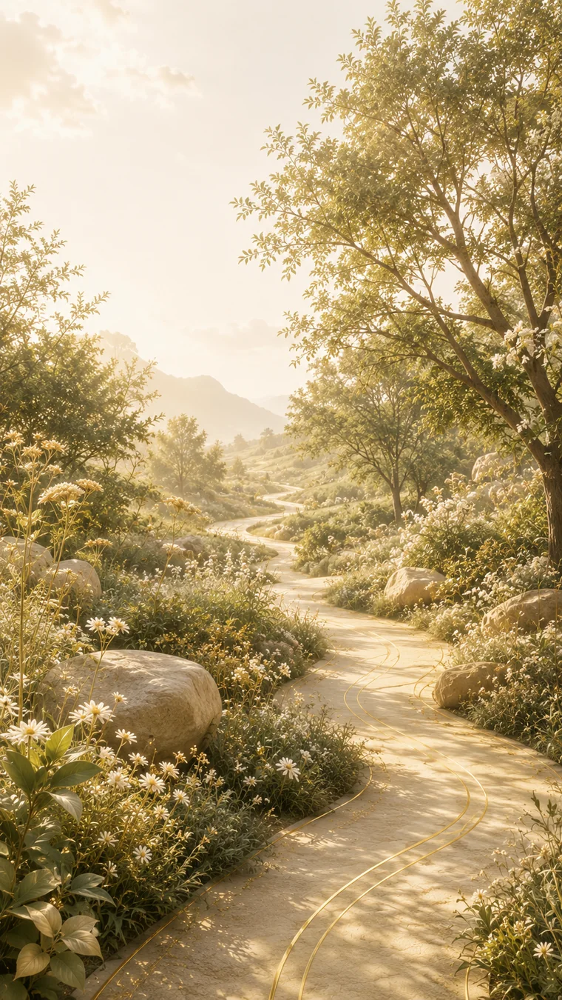
  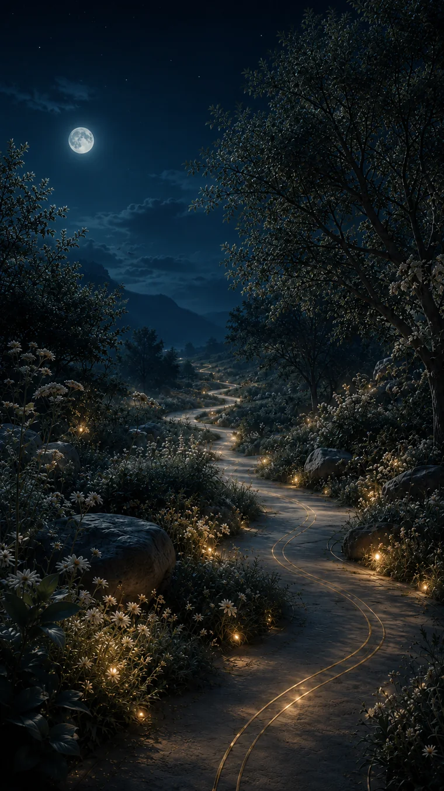
</p>

### Роль

Сад тишины — центральное природное пространство и основная точка входа во вселенную. Он не полностью дикий и не формально ухоженный: природа выглядит свободной, но безопасной. Светлая тропа проходит между деревьями, камнями и белыми цветами.

### Смысл

Сад выражает состояние, в котором человеку не нужно немедленно действовать или объяснять себя. Это место паузы перед вопросом, разговором или выбором.

### День

Днём сад открыт и наполнен золотистым воздухом. Он подходит для:

- знакомства с NURA;
- начала практики;
- разрешения замедлиться;
- внимательности к текущему состоянию;
- мягкого приглашения в продукт.

### Ночь

Ночью тот же сад становится интимнее. Золотая линия и небольшие точки света позволяют продолжать движение, хотя весь маршрут не виден.

Подходящие темы:

- мысли перед сном;
- внутреннее одиночество;
- вопросы без немедленного ответа;
- спокойная поддержка;
- короткие атмосферные ролики без озвучки.

### Анимация

Медленное движение камеры вдоль тропы, колебание цветов и ветвей, движение облаков и скольжение света. Ночью — очень мягкое мерцание локальных огней.

---

## 6.2. Дом тихого света

<p align="center">
  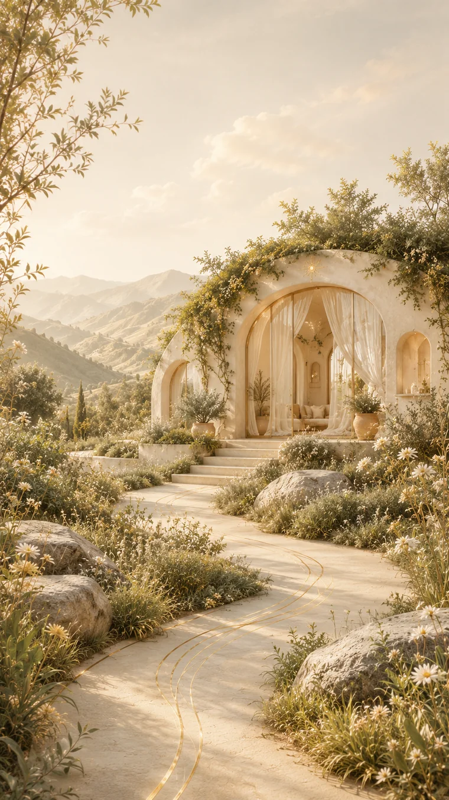
  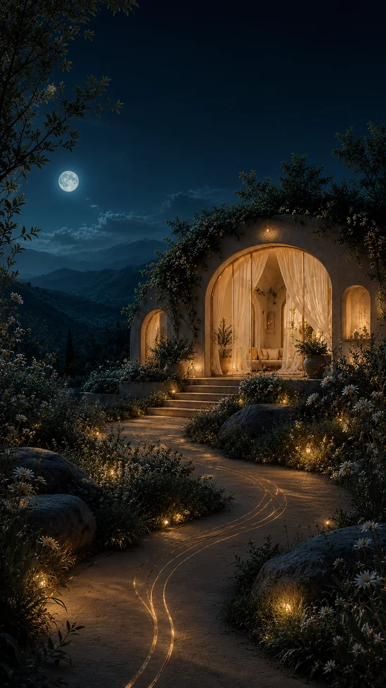
</p>

### Роль

Дом тихого света — место, где обитает NURA. Это не бытовой дом с жёстко заданной планировкой, а открытое убежище, встроенное в сад и горный ландшафт. Архитектура не отделяет внутреннее от внешнего: большие арки, занавеси и растения позволяют природе входить внутрь.

### Смысл

Дом символизирует безопасное пространство для диалога. В нём не нужно заслуживать право быть услышанным.

### День

Днём дом почти растворён в ландшафте. Он подходит для:

- знакомства с миром NURA;
- приглашения войти;
- объяснения принципов продукта;
- перехода из внешнего шума во внутреннее пространство.

### Ночь

Ночью тёплый свет дома становится ориентиром на фоне глубокой синей долины. Дом не «спасает от страшной ночи», а предлагает место, где можно ненадолго остановиться.

Подходит для:

- поддержки;
- тем доверия;
- вечернего ритуала;
- ощущения «NURA рядом»;
- финальных CTA с мягким приглашением.

---

### 6.2.1. Салон присутствия

<p align="center">
  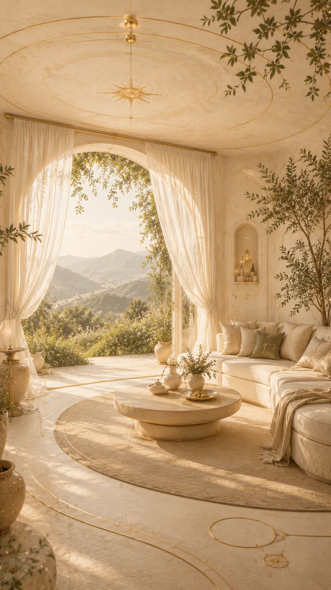
</p>

Главная общая комната дома. Округлый диван, низкий стол, круговой ковёр, живая зелень и открытый вид на горы формируют пространство, где беседа не имеет формальной дистанции.

**Использование:**

- длинные разговоры NURA с героиней;
- объяснение сложной мысли;
- сцены возвращения после пути;
- спокойное подведение итогов;
- визуальные заставки для диалогового инструмента NURA.

**Правило:** интерьер не должен превращаться в luxury-отель. Его премиальность строится на свете, материалах, тишине и целостности, а не на дорогих предметах.

---

### 6.2.2. Комната размышления

<p align="center">
  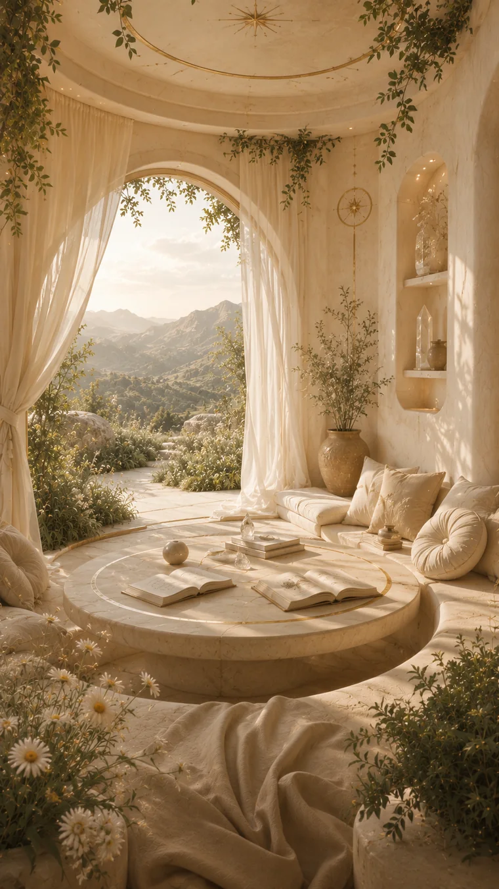
</p>

Более камерное пространство с книгами, круговым столом и низкими местами для сидения. Оно предназначено не для получения «тайных знаний», а для записи наблюдений, сопоставления символов и спокойной работы с вопросом.

**Использование:**

- дневник и рефлексия;
- объяснение Матрицы судьбы;
- подготовка к Таро-практике;
- чтение отчёта;
- короткая образовательная серия;
- продуктовые сцены, где интерфейс может появляться поверх визуала.

**Запрещено:** превращать комнату в магическую лабораторию, храм кристаллов или библиотеку пророчеств.

---

## 6.3. Дерево присутствия

<p align="center">
  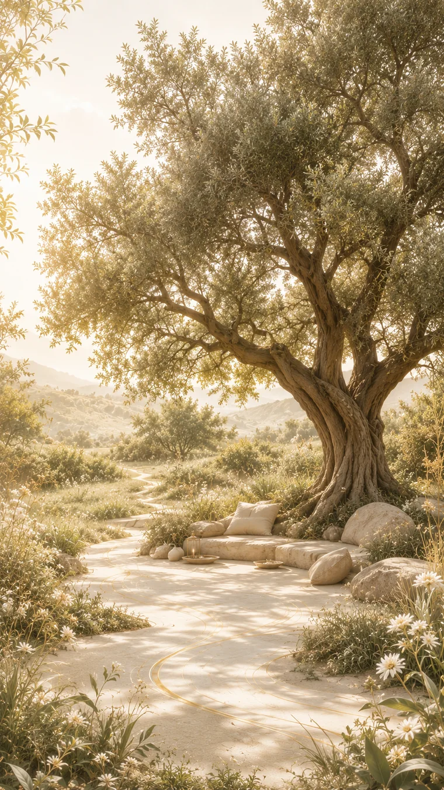
  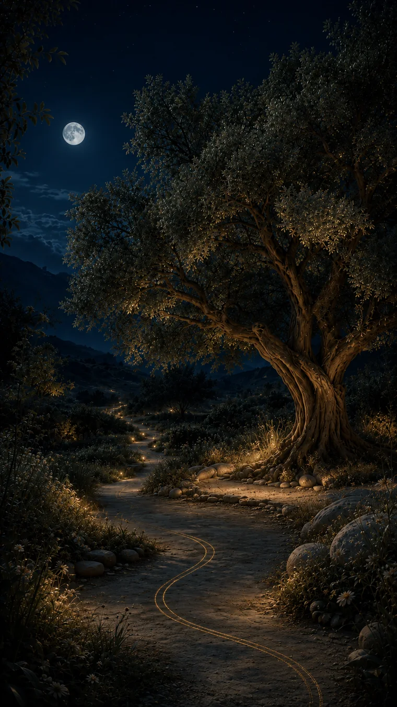
</p>

### Роль

Главный природный ориентир мира. Старое оливковое дерево с мощным живым стволом и широкой кроной. Возле него можно сидеть, молчать, ждать или возвращаться после сложного разговора.

### Смысл

Присутствие без давления. Дерево ничего не объясняет и не требует изменений; оно показывает, что устойчивость может быть спокойной, а не жёсткой.

### Темы

- «Не всё нужно исправлять прямо сейчас»;
- опора;
- возвращение к себе;
- принятие временного состояния;
- устойчивость;
- взросление;
- способность оставаться рядом с собой.

### День и ночь

Днём дерево подчёркивает ясность и телесность: свет, кора, земля, подушки и пространство отдыха. Ночью оно становится точкой возвращения и спокойным хранителем пространства, но не сакральным объектом поклонения.

---

## 6.4. Камень беседы

<p align="center">
  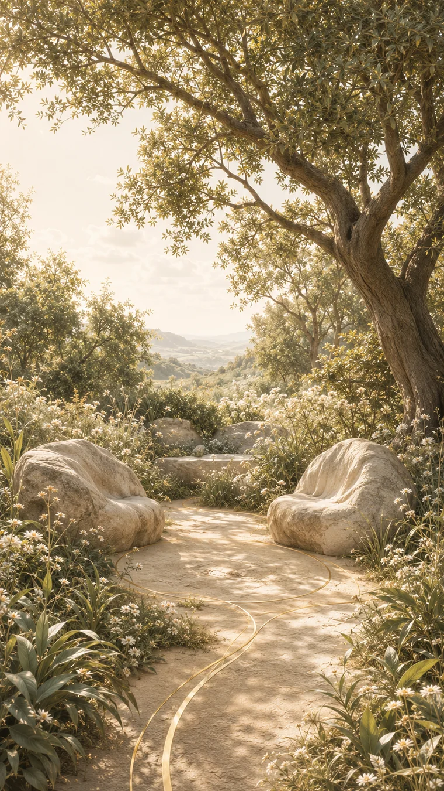
  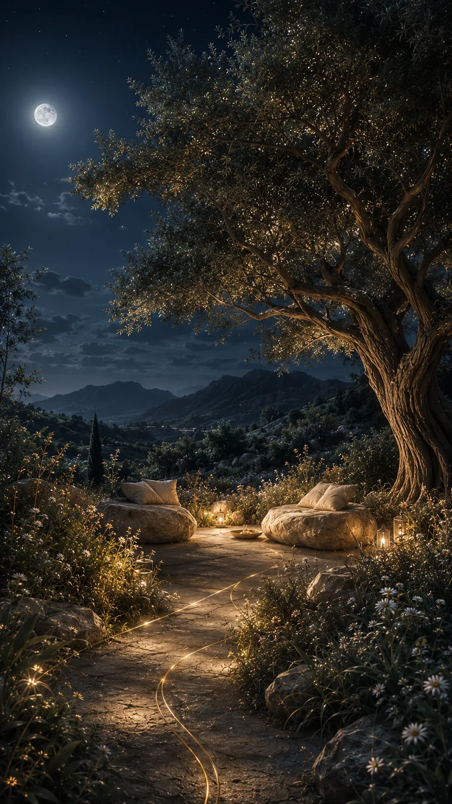
</p>

### Роль

Два естественных каменных места, обращённых друг к другу. Это одна из главных сцен для диалогов NURA и героини.

### Смысл

Равноправный разговор. Ни одно место не расположено выше другого; NURA не выступает судьёй или преподавателем.

### Подходящие сюжеты

- «Я не понимаю, что чувствую»;
- отношения и границы;
- усталость;
- внутренний конфликт;
- вопрос пользователя и ответ NURA;
- уточнение смысла карты или энергии;
- разговор, в котором нет немедленного решения.

### День и ночь

Днём сцена подходит для ясного, спокойного разбора. Ночью — для более личных тем, доверия и мыслей, которые трудно произнести вслух.

### Анимация

Камера медленно приближается по золотой линии к двум местам. Допустимы движение ветвей, цветов, лунного света и локальных фонарей. Не следует анимировать камни как магические объекты.

---

## 6.5. Золотая тропа

<p align="center">
  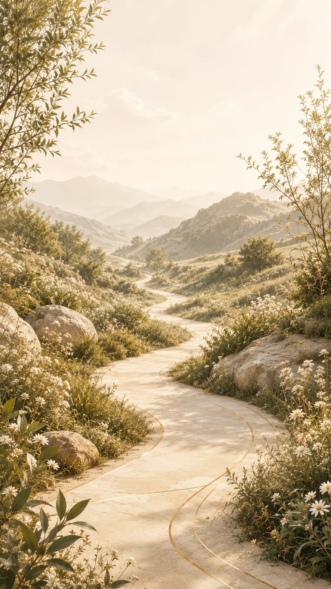
  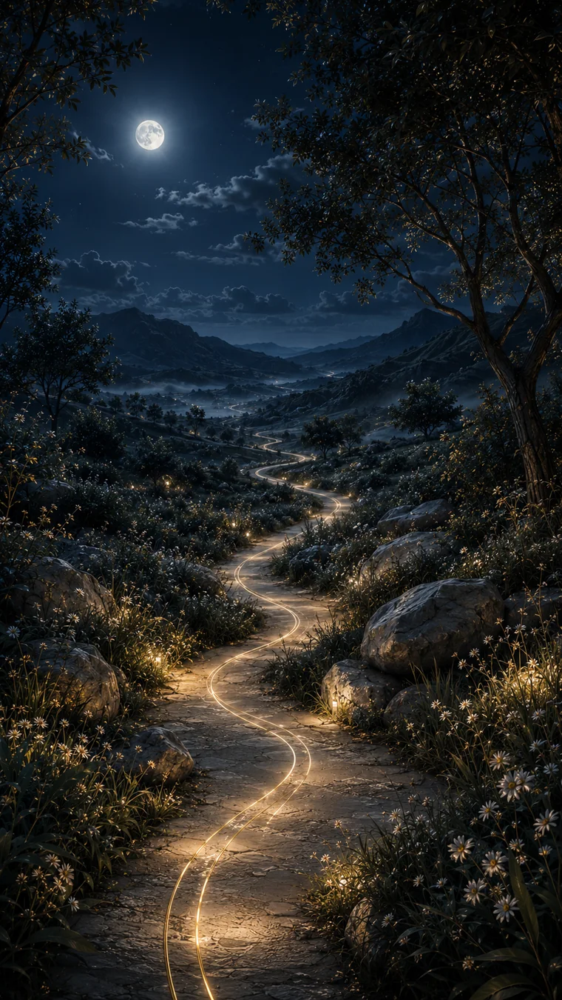
</p>

### Роль

Главный переходный образ вселенной. Тропа соединяет локации и позволяет показывать внутреннее движение без буквального путешествия.

### Смысл

Путь не равен готовому плану. Золотые линии показывают связь между шагами, но не гарантируют, что весь маршрут будет известен заранее.

### Подходящие темы

- начало изменений;
- путь к себе;
- маленький следующий шаг;
- возвращение после отклонения;
- движение в неопределённости;
- переход между частями сценария;
- вступления и финалы сюжетных роликов.

### День и ночь

Днём путь открыт, но извилист. Ночью видна только ближайшая часть, и этого достаточно для продолжения.

### Правило

Не использовать формулировки вроде «тебе предназначен единственно верный путь». Тропа должна поддерживать свободу выбора.

---

## 6.6. Река вопросов

<p align="center">
  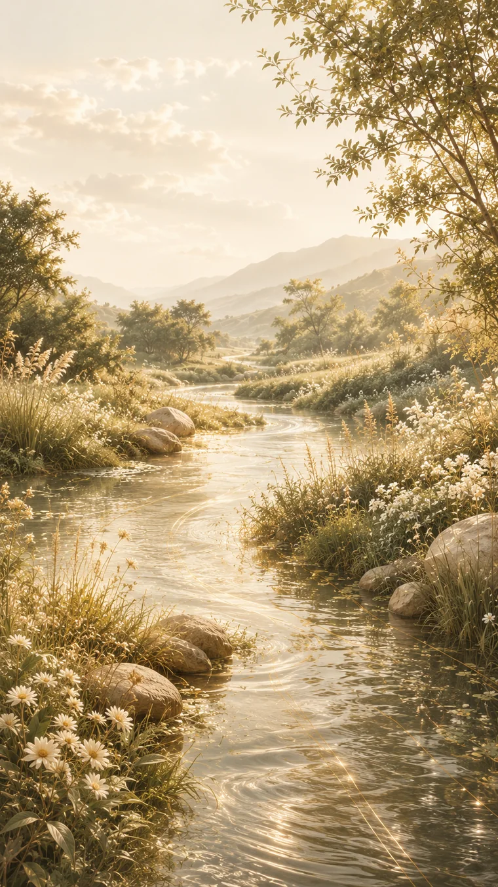
  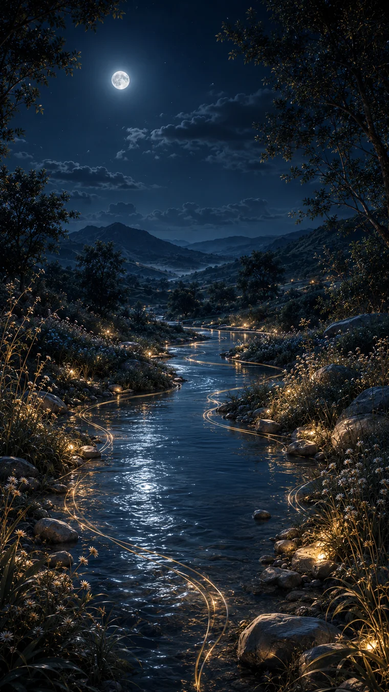
</p>

### Роль

Живое движущееся пространство. В отличие от озера, река не удерживает образ — она переносит, связывает и изменяет его.

### Смысл

Вопрос не всегда требует немедленного ответа. Он может двигаться вместе с человеком, становиться точнее и менять форму.

### Подходящие темы

- один вопрос дня;
- состояние, которое пока трудно назвать;
- смена точки зрения;
- незавершённость;
- отпускание необходимости всё понять;
- плавный переход от одной мысли к другой.

### Анимация

Вода должна действительно двигаться: лёгкое течение, блики, отражения и едва заметное движение золотых линий. Формат особенно подходит для атмосферных роликов с музыкой и одной короткой фразой.

---

## 6.7. Зеркальное озеро

<p align="center">
  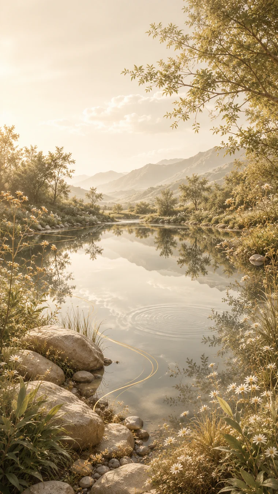
  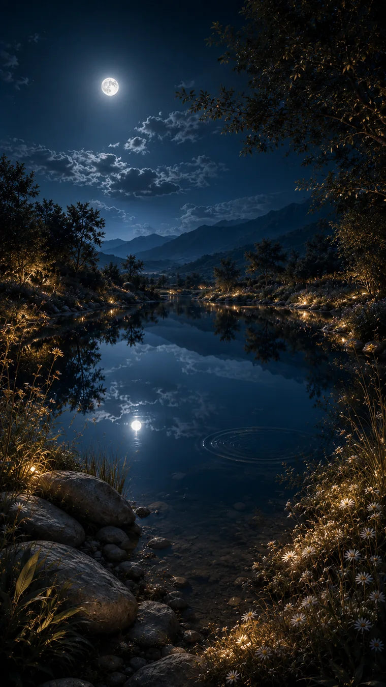
</p>

### Роль

Место неподвижного отражения. Озеро используется тогда, когда история требует не движения, а внимательного взгляда.

### Смысл

Самонаблюдение без самосуда. Отражение не сообщает человеку, «кто он на самом деле», а помогает увидеть то, что уже присутствует.

### Подходящие темы

- образ себя;
- маска и роль;
- расхождение между внешним и внутренним;
- повторяющийся сценарий;
- честный вопрос;
- выбор карты как зеркала;
- признание неоднозначности.

### Круги на воде

Круги показывают, что даже небольшое наблюдение меняет целую картину. Они не должны превращаться в портал или магическое предсказание.

---

## 6.8. Горы перспективы

<p align="center">
  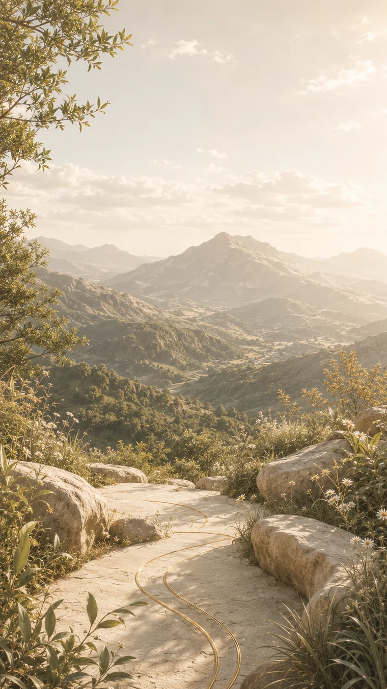
  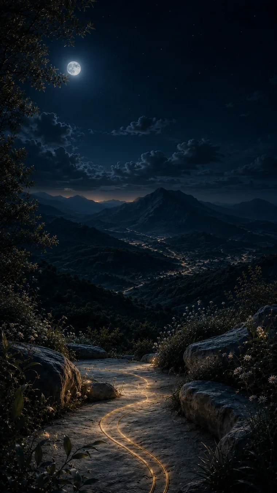
</p>

### Роль

Самая масштабная обзорная локация. Человек поднимается сюда не ради достижения вершины, а чтобы увидеть ситуацию шире.

### Смысл

Дистанция может дать ясность. То, что казалось единственной проблемой, становится частью более большого ландшафта.

### Подходящие темы

- взгляд на жизненный период;
- подведение итогов;
- смена перспективы;
- «что изменится, если посмотреть шире»;
- прогноз года как набор тем, а не предсказание;
- завершение большой истории.

### День и ночь

Днём видна структура долины и взаимосвязь маршрутов. Ночью золотые линии далеко внизу показывают множество человеческих путей и решений.

### Анимация

Лучше всего работает медленный zoom-out, усиливающий ощущение масштаба.

---

## 6.9. Долина выбора

<p align="center">
  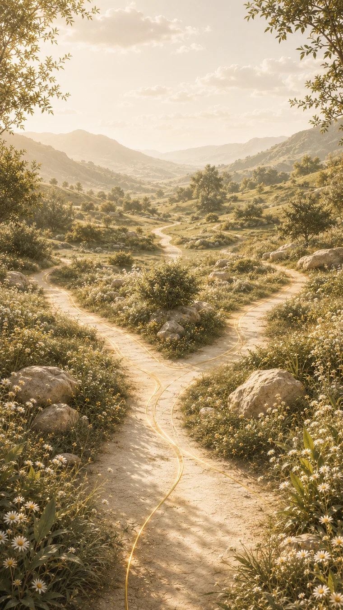
  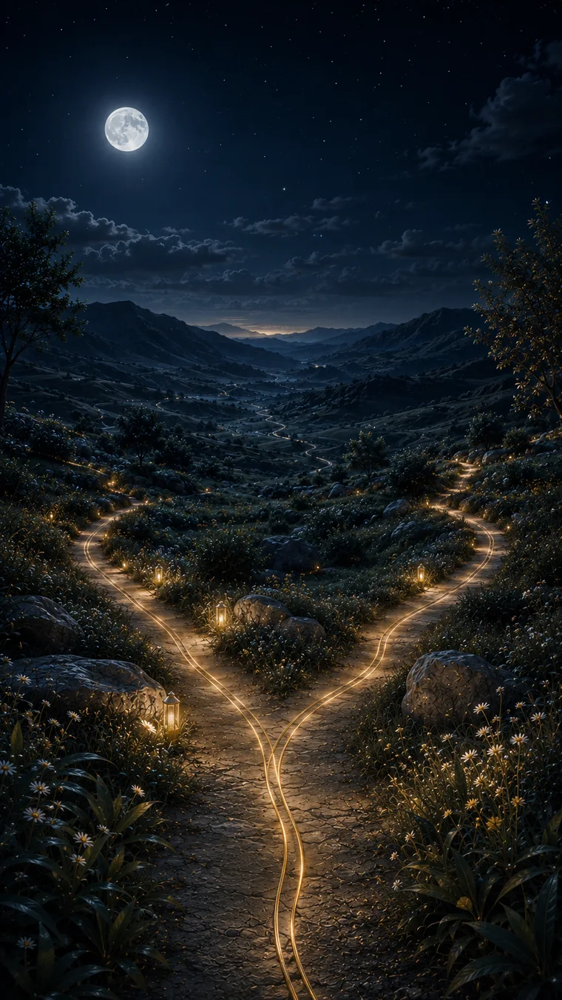
</p>

### Роль

Пространство, где один путь разделяется на несколько. Ни один маршрут не выглядит опасным, плохим или заведомо правильным.

### Смысл

Выбор — это не экзамен на правильность. Он может быть исследованием ценностей, ограничений и желаний.

### Подходящие темы

- сомнения;
- решение о работе или отношениях;
- конфликт между «хочу» и «надо»;
- страх ошибиться;
- несколько допустимых сценариев;
- совместимость как понимание динамики, а не приговор.

### Правило

Не подсвечивать один путь как магически избранный. Золотые линии могут расходиться равноправно.

---

## 6.10. Павильон символов

<p align="center">
  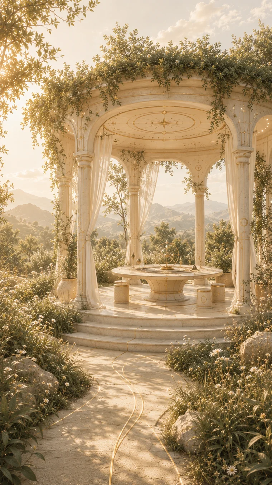
  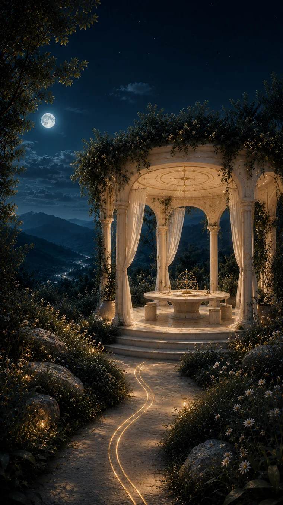
</p>

### Роль

Главное место для работы с Матрицей судьбы, Таро и символическими практиками. Павильон открыт природе и не скрывает «тайные знания» за закрытыми дверями.

### Смысл

Символ — не доказательство и не пророчество. Это поверхность, на которой человек может заметить собственные ассоциации, реакции и вопросы.

### Архитектура

- круговая форма;
- арки и колонны;
- светлый камень;
- воздушные занавеси;
- зелень, входящая внутрь;
- звезда-компас на потолке;
- мягкая золотая инкрустация.

### День и ночь

Днём павильон связан с любопытством и изучением. Ночью — с ритуалом внимания, но не с оккультной тайной.

---

### 6.10.1. Стол смыслов

<p align="center">
  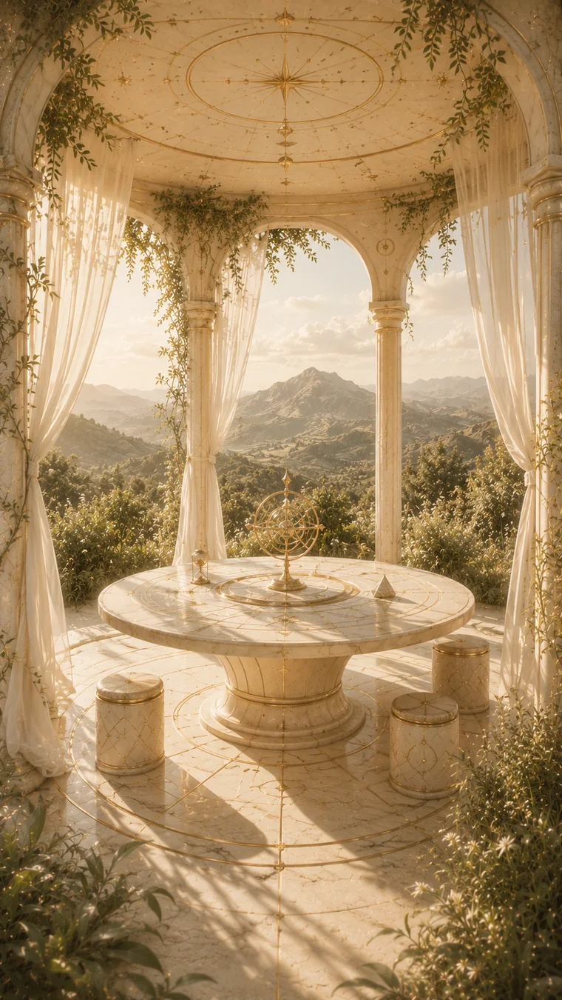
</p>

Центральный круглый стол предназначен для раскладки карт, схем Матрицы и визуальных сопоставлений. Абстрактный инструмент в центре напоминает астролябию, но не должен трактоваться как устройство для определения будущего.

**Подходящие сцены:**

- карта дня;
- мини-расклад;
- объяснение аркана;
- Матрица судьбы;
- сопоставление нескольких символов;
- образовательные ролики;
- переход к интерфейсу продукта.

---

### 6.10.2. Павильон тихих разговоров

<p align="center">
  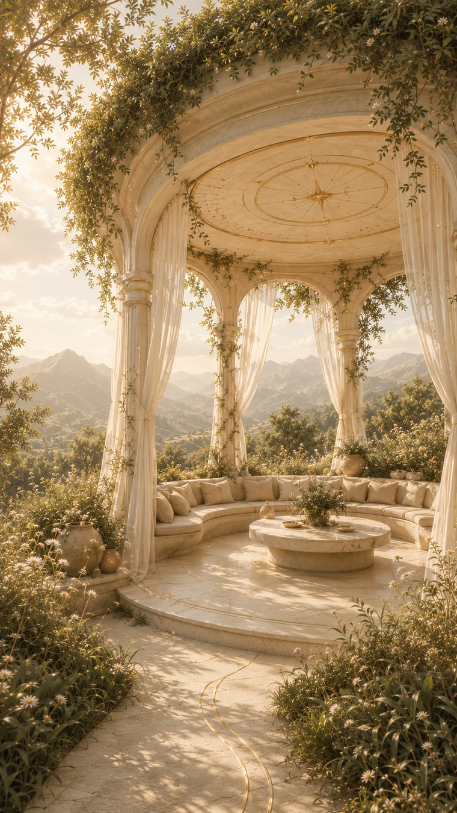
</p>

Более мягкая зона павильона с круговым диваном. Она объединяет открытость сада и защищённость интерьера.

**Подходящие сцены:**

- разговор небольшой группы;
- будущий коллективный режим Лилы;
- диалог NURA с несколькими сторонами личности;
- серия вопросов от аудитории;
- общая практика без ощущения публичного выступления.

---

## Reference G. Правила появления персонажей

`CURRENT BRAND STANDARD` for the approved NURA identity and generic user character. Any new named or extended character remains `FUTURE VISION`.

## NURA

Внутри обновлённой вселенной NURA изображается в том же общем визуальном языке:

- полуреалистичная цифровая editorial-иллюстрация;
- сохранение утверждённого лица;
- кремовая или ivory-одежда;
- sage-акценты допустимы;
- спокойная взрослая пластика;
- естественные жесты;
- отсутствие театральной мистической мимики.

NURA может:

- ждать у Дерева присутствия;
- сидеть напротив у Камня беседы;
- идти рядом по Золотой тропе;
- находиться в Доме тихого света;
- сопровождать работу в Павильоне символов.

NURA не должна:

- парить;
- излучать сверхъестественную энергию;
- выглядеть богиней или жрицей;
- указывать человеку сверху вниз;
- изображать абсолютную уверенность в чужой судьбе.

## Героиня или пользовательский персонаж

Героиня должна быть узнаваемо живой, современной и эмоционально правдоподобной. Она не обязана выглядеть идеально. Её одежда может быть простой, светлой и нейтральной.

В сюжетах важно сохранять субъектность героини: NURA не «исправляет» её и не принимает решения вместо неё.

---

## Reference H. Использование в видео

`CURRENT BRAND STANDARD` for editorial production patterns using existing assets. New product/video systems remain `FUTURE VISION`.

## Формат A — сюжетный ролик

Вселенная используется как последовательность сцен:

1. установочный кадр локации;
2. появление героини или NURA;
3. диалог или внутреннее наблюдение;
4. символический переход;
5. финальный вопрос или мягкий CTA.

На изображениях допустимы pan, zoom, Ken Burns, параллакс, световые изменения и простые переходы. Голос NURA и субтитры являются основными носителями смысла.

## Формат B — живое пространство

Одна локация получает лёгкую анимацию, музыку и короткую мысль.

Подходящие места:

- Сад тишины;
- Золотая тропа;
- Река вопросов;
- Зеркальное озеро;
- Горы перспективы;
- ночной Дом тихого света;
- ночной Павильон символов.

Первая версия формата B может использовать только музыку и написанную мысль без озвучки.

---

## Reference I. Текст поверх изображения

`CURRENT BRAND STANDARD — editorial content only`

- Одна мысль на экран.
- Не закрывать главный символ локации.
- Не помещать текст в нижнюю часть, перекрываемую интерфейсом платформ.
- Для дневных сцен использовать тёмный muted olive или charcoal с мягкой тенью.
- Для ночных сцен использовать warm ivory.
- Золотой текст допустим только как небольшой акцент.
- Максимум две фазы появления текста в атмосферном ролике.
- Не использовать декоративный курсив для длинных фраз.

---

## Reference J. Музыка и звук

`CURRENT BRAND STANDARD — editorial content only`

### День

- мягкое фортепиано;
- тёплые струнные;
- воздушные ambient-текстуры;
- природный фон;
- отсутствие чрезмерно «эзотерических» колокольчиков.

### Ночь

- глубокий ambient;
- редкие низкие ноты;
- тихие струнные;
- пространство и паузы;
- отсутствие тревожного саунд-дизайна.

Звук усиливает глубину, но не сообщает зрителю, что происходит нечто опасное или сверхъестественное.

---

## Reference K. Запреты

`CURRENT BRAND STANDARD — safety and visual exclusions for content production`

Во вселенной NURA не используются:

- тёмный оккультизм;
- хоррор;
- кровавые или тревожные символы;
- магические порталы;
- сияющие руны;
- гадальные клише;
- избыточные свечи и кристаллы;
- тяжёлые храмы;
- неон;
- пластиковый CGI;
- акварельная размытость как основной стиль;
- гиперреалистичная фотография;
- буквальные надписи внутри сгенерированной сцены;
- визуальный язык «избранного пути»;
- явное деление решений на светлые и тёмные.

---

## Reference L. Формула новых editorial generations

`CURRENT BRAND STANDARD` for proposed content assets. New production assets still require the normal review/approval workflow and do not become product scope automatically.

Для новых изображений необходимо сохранять:

> **NURA Cinematic Editorial Realism + вертикальный 9:16 + тёплый светлый камень + sage/olive-природа + мягкое золото + горный ландшафт + ясная глубина + безопасная эмоциональная атмосфера.**

Каждая новая сцена должна отвечать на четыре вопроса:

1. К какой существующей локации она относится?
2. Какой внутренний процесс она выражает?
3. Какой повторяющийся символ связывает её с остальным миром?
4. Может ли зритель узнать вселенную без логотипа и подписи?

Если ответ хотя бы на два вопроса неясен, изображение не следует добавлять в канон.

---

## Reference M. Структура ассетов

`CURRENT BRAND STANDARD — canonical registry and existing preview paths`

Канонический путь документа:

```text
docs/brand/nura-universe/README.md
```

Манифест:

```text
docs/brand/nura-universe/assets-manifest.json
```

Превью изображений:

```text
docs/brand/nura-universe/assets/
```

Манифест содержит стабильные ID, назначение сцен, время суток, рекомендуемые типы движения и safe zone для подписей. Эти поля можно использовать в LOOPRA при формировании Production Brief и выборе визуальных сцен.

---

## Boundary conclusion

Вселенная NURA — это единая визуальная система, где красота не является самостоятельным декором. Каждый объект помогает выразить продуктовую позицию:

- **Сад** даёт паузу.
- **Дом** даёт безопасное пространство.
- **Дерево** даёт присутствие.
- **Камень** даёт равноправный разговор.
- **Тропа** даёт движение.
- **Река** позволяет вопросу продолжаться.
- **Озеро** даёт отражение.
- **Горы** дают перспективу.
- **Долина** сохраняет свободу выбора.
- **Павильон** превращает символы в инструмент самопознания, а не предсказания.

Эта система является текущей основой для визуального/editorial контента NURA, сценариев, каруселей и видеороликов в пределах approved content workflow. Расширенная вселенная и возможный контент-завод LOOPRA остаются `FUTURE VISION` и не входят автоматически в NURA 1.0/1.5 roadmap.
